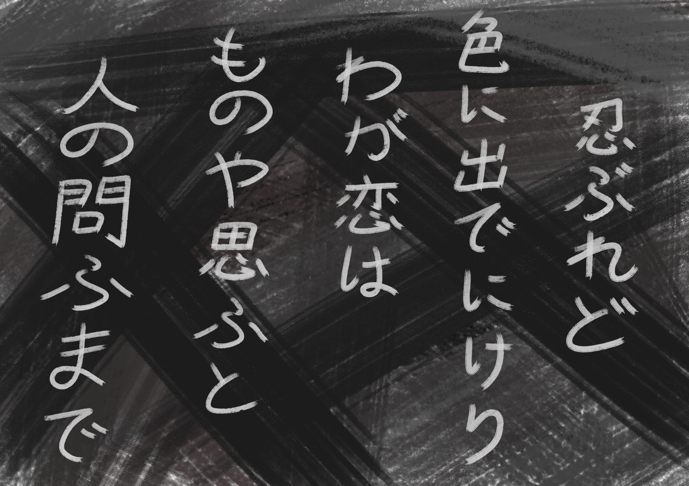

# Karuta

I guess one could argue, that I've always been a sucker for poetry. I could never get enough of them nursery-rhymes as a toddler and then all through elementary and middle-school I was really into competitive Karuta, mainly bec of the poetry involved.

Mathematics on the other hand, well let's just say, that math was never exactly my cup of tea.

So, when I started my first year of high-school, still back in Japan, I was, tbh, something of a poetry-geek, and one who couldn't have cared less about mathematics at that, but then, all of a sudden, there was SHE, and that changed everything. 

All of a sudden I found myself sitting in our library practicing math, for hours at a time, and all bec of HER, who wasn't even aware of my existence.

Also, even when I was spending time on non-math-related matters, I would still find that math problems kept popping into my head and to the forefront of my attention.

So let's take Karuta as an example. You do know about Karuta, right? Well if not, suffice it to say that there are 100 different poems / cards in 競技かるた, but only half of those are selected, at random, to be in the game. ( The other 50 cards are called 空札. )

Now, there used to be 3 poems in particular, that I fancied WAAAAY more than the rest of the lot.

Here is one of them for u... just to give u an idea. :-)

In fact, if at least one of my favorites was in the game, I used to feel perfectly at ease before the start of the match.

And that never changed, but suddenly, I would find myself wondering about stuff like: What is the probability of that happening?

Can u figure it out?

Ganbatte!