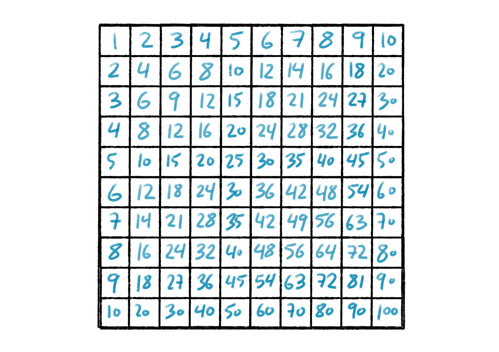

# Gauss

The great German mathematician Gauss found, at age 17, a value for cos(360°/17). That way he was able to show that one can construct a regular convex 17-gon using ruler and compass.

I am telling you this, because, back in the day, the most popular girl at my high school, she was also the math-club's president, and she proofed, fully independently, the same thing for the 65537-gon, at age 65537/16^3.

Anyway, everybody told me that trying to 告白 was entirely pointless, since the only thing she was interested in was mathematics, but I stubbornly refused to accept this 無駄美人 myth, which is why I seriously considered quitting karuta and to join her math-club instead.

Now it used to be common knowledge, that she presented everybody who wanted to join, with a pretty tough admission question and tbh, at the time, I did not know the first thing about math whatsoever, so one could perhaps argue that my plan was, right from the outset, suffering from something of a major shortcoming, but I was still young, thought '頑張って' to myself, threw the dice up high and knocked at the math-club-room's door; sweaty handed.

Now everything about the math-club-president was just ridiculously charming, so I was over the moon just talking to her, but all too soon time came for my admission-test and with that ドキドキ turned ビクビク.

Anyway, she handed me the following piece of paper:

As soon as I layed eyes on that multiplication table, I somehow felt immediately like I was in serious trouble.

She smiled.

I trembled.

She: "You ready?"

Me: "えっと"

She: "No worries. This won't take long."

Me: "ええっと"

She grinned.

I panicked.

She: "So, I am gonna ask you a question now. After that you have 60 seconds to come up with an answer that I find to be satisfying enough."

Me: "えええっと"

She: "What do all of these numbers add up to?"

Me: "ええええ！？"

She: "59"

Me: "Does that mean I am supposed to calculate that it in my head?!"

She: "57"

I understood immediately, that I had to make the most of every single second I was given, so I focused as hard as I possibly could on those numbers; read them from left to right, from right to left, from top to bottom, from bottom to top...

Suddenly my brian was somehow able to switch into 'overdrive-mode' and I realized that rather miraculously I had managed to enter 'the zone', became fully aware of how things had mathemagically begun clicking inside my mind.

What a rush! Never had I experienced anything like this before in my entire life. It felt incredibly 気持ちいい！

She: "4"

She: "3"

Countless digits were still dancing elegantly through my head, like 桜 in a gentle spring breeze.

She: "2"

Me: "付き合ってください！"

She: ":x: です。"

Would you have been able to please the president?

Ganbatte!
