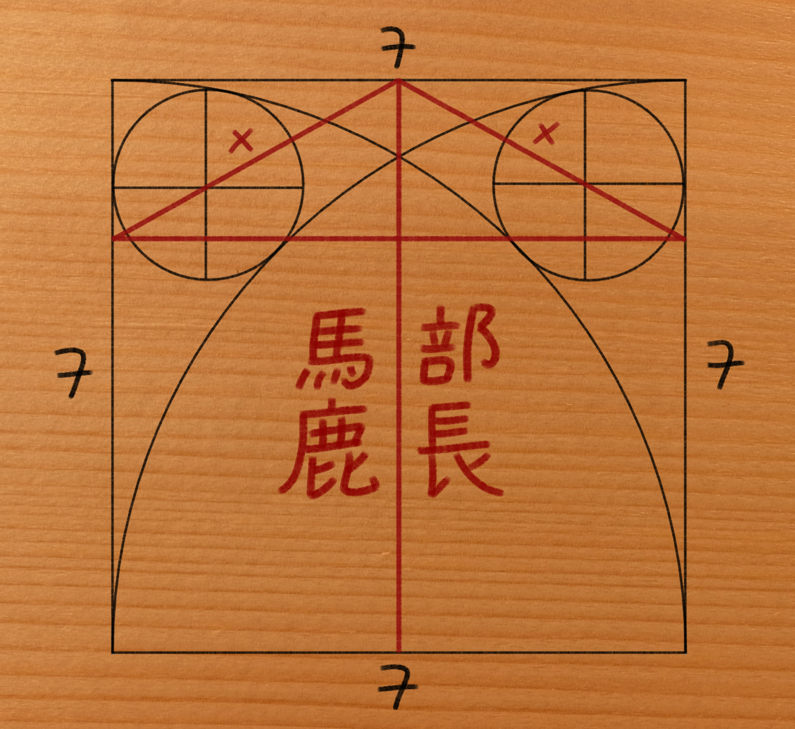

# Sangaku
During high school, I constantly found myself hard pressed for money, and so, I guess, I would sometimes speculate about how nice it would be, if I were well off financially.

Today, what feels like several millennia later, I can't help but to fantasize about / long for those unique pleasures and joys that are an inextricable part of what it means to be young.

Really, seams to me, that my entire conception of "wealth" has gained rather dramatically in complexity and depth over the years and with the passing of time.

For example, consider the following, extraordinarily beautiful, poem by William Wordsworth:

    I wandered lonely as a cloud
    That floats on high o'er vales and hills,
    When all at once I saw a crowd,
    A host, of golden daffodils;
    Beside the lake, beneath the trees,
    Fluttering and dancing in the breeze.

    Continuous as the stars that shine
    And twinkle on the milky way,
    They stretched in never-ending line
    Along the margin of a bay:
    Ten thousand saw I at a glance,
    Tossing their heads in sprightly dance.

    The waves beside them danced; but they
    Out-did the sparkling waves in glee:
    A poet could not but be gay,
    In such a jocund company:
    I gazed — and gazed — but little thought
    What wealth the show to me had brought:

    For oft, when on my couch I lie
    In vacant or in pensive mood,
    They flash upon that inward eye
    Which is the bliss of solitude;
    And then my heart with pleasure fills,
    And dances with the daffodils.

Now, tbh, I am not quite sure what it means :-), but maybe it wants to suggest, that, rather than piling up stock, buying up real-estate, and what have you,... how about investing in high-quality memories? For isn't that recollection of those innumerous elegantly swaying daffodils a magnificent tressure? A jewel so precious, no amount of gold could ever hope to buy?

Anyway, the reason I bring this up is because, when I first went out on a デート with the 部長, I was as short of money as one could be, nevertheless, when I am having, every so often, a "Wordsworth-moment" myself, I am certainly not thinking ordinary flowers like that, much less daffodils! The flowers that are the bliss of my solitude are much more passionate and fiery than that! Namely, they are the countless reflections of 花火(fireworks) sparkling in the mesmerizing eyes of the 部長.

Buuuut, I guess that's just the culminating highlight and it doesn't really give you any of the juicy details of how a teenage dirtbag like me could possibly have been so lucky as to experience a perfectly magical and utterly unforgettable moment like that.

So, let me explain; here is what went down:

After our little tête-à-tête, the 部長 and I started texting,... like a lot.

Everything was just preposterously exiting!

I would spend hours pondering over whether I should write: "If there is milk or sugar in it, then I am not drinking coffee." or "If I am drinking coffee, then there better be no milk and no sugar in it."... stuff like that.

Aaaanyway, it just so happened, that the big local お祭り(festival) was just awaiting around the corner and so we decided that it would make for the perfect opportunity and occasion for our first real デート; needless to say that I felt 超緊張(super nervous)!

In fact, I was so desperate to make things work, I would even go so far as to turn to my parents for help! Then again, I did need some dough though, so in part it was also 仕方ない(unavoidable), I suppose; needless to say it turned out bloody brutal!

Here is the relevant excerpt from the convo that happened over dinner:

Mom: "So, how is school?"

Me: "Fine!"

Mom: "Just fine?"

Me: "Actually, I wanna do グラッパ-お祭り(grappa-festival) with someone from school this year, so... some extra 小遣い(spending money) would be much appreciated."

Dad: "No."

Mom: "Who?"

Me: "What?"

Mom: "What friend?"

Me: "Nobody you'd know."

Mom: "Try me."

Me: "I'd rather not."

Dad: "No name, no money. Period."

Me: "Come on!"

Mom: "Wait,... まさか(no way?!)... is it a girl?"

I blushed.

They smirked.

Dad: "Well, you know, parents really shouldn't pry, should they?"

Dad fetched his wallet and handed me a sum I would never even have allowed myself to hope for.

Dad: "Well, it is in the nature of things that boys, sooner or later, turn man..."

Dad: "also, should u ever need some advice on stuff, you know where to find me."

Mom: "If your father is ever to hand you down some of his advice, I would strongly suggest for u you to act in a way that is the exact polar opposite."

Dad: "失礼よ(how rude)！"

Dad: "Also, if am so clueless, how come we ended up getting married? :-)"

Mom: "Don't remind me! :-)"

Me: "Aaaanyway, as always,... real good talking to u folks..."

I rolled my eyes.

Me: "Gotta scoot now; thx a bunch; laterす!"

I got up.

Me: "Also, just for the record, would u guys mind dialing down the cute 夫婦(husband and wife)-banter thing a notch? It is kinda gross u know..."

Dad: "Don't push your luck too hard son! Now... zip it and get lost!"

In any case, with that, I had successfully managed to procure a decent amount of cash, and obviously I wanted to spend it on a nice プレゼント(present) for the　部長; on something that could express that I really did care lots about her; the 問題(problem) was just that, when thinking about what to get her, I drew a complete blank.

Then, before I knew it, グラッパ-お祭り had arrived!

I showed up three-quarters of an hour early at the entrance-gate, which was our agreed-upon meeting place.

So there I was, a complete nervous wrack; trying to calm myself down, by, for the millionth time, going over some conversation-aid-cards I had prepared beforehand, which is why I felt totally おどろいた(surprised), when she suddenly stood there right in front of me; 20 min ahead of time.

She: "お待たせ(thank you for waiting)。"

I was stunned. Rendered fully speechless by the breathtaking sight of the 部長 all dressed up in 浴衣(yukata - kimono worn in the summer) and 下駄(geta - Japanese wooden clogs).

She turned her body from side to side every so slightly.

She: "どう(what do u think; do I look all right)？"

I was still completely petrified, because of her insane gorgeousness.

She: "大丈夫(u ok)？"

Me: "...mm... not quite sure... somehow I feel like I might come down with a nosebleed..."

She smiled.

She: "馬鹿！"

Me: "はい。"

She took my arm.

She: "じゃ行こうか(let's go)。"

Me: "はい。"

Strolling around the buzzing area was just 最高(awesome)! There were lots of food stands too! For example they had たこ焼き(takoyaki - octopus dumplings)　and 焼きそば(yakisoba - fried noodles,), etc. but since we weren't hungry and also since we had so much to talk about, we just enjoyed a delicious bottle of ラムネ(lemon soda), but other than that, just went ペラペラ(speaking fast); non-stop.

For example: She told me all about this amazing Euler person. Apparently the guy was like the most prolific mathematician ever! Also, according to the great thinker himself, one of his best math-ideas came to him, while holding an infant tenderly in his arms, with other kids playing around his feet! What a feat, right? Also, while working at the Academy of Science in Berlin, Euler got to know Frederick the Great, who, by the by, started out King IN ( NOT OF ) Prussia, but unlike the 部長, allow me dodge that tangent and stay with Euler, by mentioning his progressive blindness, which, thanks to the help he got from his sons and others, seams not have been able to slow down the productiveness of his remarkable genius. In fact, after first losing his right eye Euler is reputed to have remarked: "Now I will have less distraction".

I on the other hand told her all about 競技かるた(competitive karuta); about the 百人一首(one hundred people, one poem each) anthology; about my three favorite poems; about the rules of the game; about 近江神宮(Omi Shrine) etc. etc.

Then, not fully by accident mind u, - she was just about to get started on the incompleteness of the axioms in Euclid's Elements and the role of Schopenhauer and Hilbert in all of this - we found ourselves standing in front of the local shrine.

Me: "待って(wait)、there is something i'd like for u to see..."

She: "え、何(oh, what is it)？"

I pointed up to a small and inconspicuous looking wooden tablet dangling under the roof of the shire.

Me: "算額です(It's a Sangaku)。"

She fixed her gaze at my gift but remained in complete silence, for what felt like an eternity.

Me: "...so,... what's your answer?"

Me: "You got one minute."

She smiled.

Me: "59"

She: "勘弁してよ。(Gimme a Break!)"

Me: "58"

She: "馬鹿！"

Me: "57"

She: "よし, 決まった(OK, i've made up my mind)！"

Me: "流石部長(the math-club-president is living up to expectations)。"

Me: "So?... I'm listening..."

She: "Would u mind me coming a little closer, coz I would hate for ppl to overhear me telling u."

Now, the shrine was a good deal away from where the main event took place, situated on a small hill, and so there was really nobody around, but the two of us; still, I obviously wasn't gonna argue, let alone object!

She leaned against me; and then she, tiptoeing on her 下駄, whispered her reply softly into my ear.

All of a sudden there were fireworks going off everywhere; like crazy! Left and right, above us, inside my stomach! Explosions everywhere! Before we knew it, the entire firmament had become an enormous canvas for this amazing 花火, which rendered it in the most magnificent colors imaginable. What a spectacle!

We looked at each other; smiling.

Me: "とにかく、:x: ですよ(Anywho, wrong answer)。"

She: "馬鹿！"

Me: "はい。"

We kissed.

Fireworks still rising to a crescendo all around us, engulfing us, transporting us into a universe made of but the brightest colors, sounds and feelings.

Me: "I wish this moment could last forever."

She: "Same."

And that is when and how I got oh so lost in, and forever spellbound by, her unforgettable eyes; how I became so immensely privileged as to witness those fiery sparks celebrating the miracle of our two youthful hearts coming together as one; racing in perfect unison.

Anyway can u make sense of the 算額?

Ganbatte!

p.s. wood pic from wikipedia: 
CC BY-SA 3.0, https://commons.wikimedia.org/w/index.php?curid=46641
