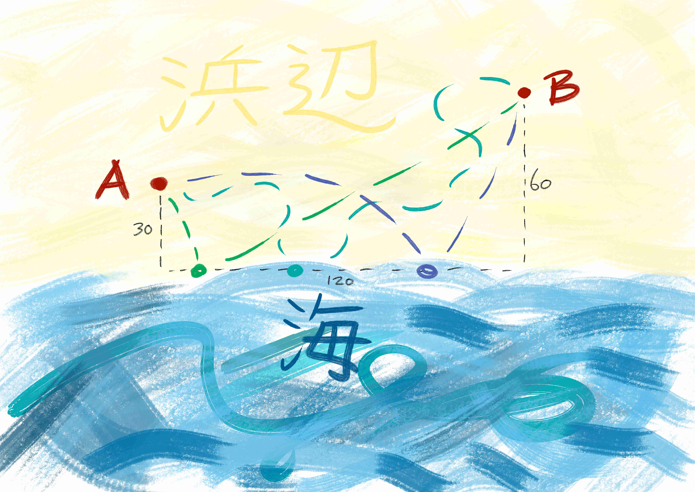

# Shortest path

Me: "ただいま(I'm home)。"

妹(younger sister): "遅いよ(you're late)!"

For some reason I found her awkwardly crouching in our 玄関(entranceway).

Me: "え(huh)."

She sported a well rehearsed pout, while pointing at her  超-cringe ピカチュウ-wristwatch.

Me: "あのね(Listen)..."

My parents appeared - cutting me off mid-sentence.

Mom: "おかえり(welcome home / back)。"

Dad: "So?"

Me: "So what?"

Mom: "So how was the festival？"

Me: "Fine."

I gave my all to fight it, but somehow I just couldn't help but smiling ear to ear.

妹: "怪しいよ(suspicious)。"

Mom: "よかった(Good for you)。"

I glanced over to my father. He just stood there grinning; then our eyes met and, get this, he would actually give me a wink!

Me: "A wink? Seriously?"

Mom: "まあまあ(let's all calm down)。"

At that point my olfactory system registered something incredibly mouth-watering.

Me(sniffing): "What's happening?"

Dad: "Hope u r hungry son、coz tonight is しゃぶしゃぶ-time(Japanese variant of hot pot)!"

Dad: ";-)"

Me: "Starving, actually. Also, plz stop with the winking. You're kinda freaking me out here!"

Mom: "まあまあ, let's just have dinner now, shall we?"

妹: "遂に(finally)！"

Now it may or may not have been bec of the overall state of complete and utter ecstasy I found myself in that night, but that しゃぶしゃぶ tasted like ambrosia to me; it really was: HEAVENLY!

Me: "おいしいよ(delicious)！"

妹: "賛成(agreed)！"

Dad: "お代わり(refill)!"

Mom: ":-)"

Mom: "This is nice. You know, spending some good old quality time as a family every once in a while."

父さん(Dad), Sis and I were busy stuffing our faces with what tasted like Wagyu, but surely wasn't.

Me: "You savour the moment, we savour the meat!"

Dad gulped down some more of his beer.

Dad: "Ahh, Super Dry!"

Mom: "Wait, how about a toast?"

Dad: "No thx, しゃぶしゃぶ tastes way better! :-)"

Mom: "Hahaha... very funny! I'm being serious here! Why do u always have to spoil things with your stupid little jokes? まったく(truly)!"

Dad: "すまん(sorry), すまん。Your right; let's have ourselves a toast..."

Dad: "Son, 頼む(I rely on u / plz take care of it)."

Me: "Jeez."

I got up.

The rest of my family exchanged looks of incredulous astonishment about my ready compliance, before following suit.

Me: "TO MATHEMATICS! 乾杯(cheers)!"

皆(everyone): "乾杯!"

That was the first time my family would raise their glasses to, of all things, MATH!

Mom: "Didn't see that coming! :-)"

妹: "Me neither! :‑O"

Dad: "数学か(so Mathematics)... 面白い(interesting)！"

妹: "I don't get it."

Dad: "Math or why ppl would find it interesting?"

妹: "Both."

Me: "I didn't get it myself either,... until recently, but now, I realize that mathematics is just so... how can I put it? Beautiful, attractive, elegant, charming,... right?"

妹: "違う(wrong)!"

Mom: "まあまあ。"

妹: "OK, since math is just sooo wonderful now, why don't you do as the Romans: PROOF IT!"

Dad seamed amused; Mom worried.

Dad: "面白い(interesting)！"

Mom: "まあまあ。"

Me(grinning): "NOP!"

Reaching into my pocket, I popped the topmost conversation-aid card from the stack I ended up never needing for its intended purpose, and confidently slammed it right under my little sister's impertinent nose.

Me: "Quod erat demonstrandum."

Everybody inspected my little sketch without comment.

妹: "Not following."

Me: "Well say you're at A and you need to take some sea-water to B; What's the shortest path possible?"

妹: "...mmh..."

Dad: "Ooh, I get it! ナイス(nice)!"

Dad offered a high-five; I turned him down; He insisted; On the spur of the moment I went for the clap, but, at the very last moment, he pulled back his hand, doing a super lame hair fixing motion.

Mom and I retaliated by looking disgruntled.

Dad: "What?! :-)"

My little sis was still grappling with the problem; but then her puzzlement somehow instantaneously metamorphosed into annoyance and so she threw the towel.

妹: "This sucks!"

Mom: "まあまあ... anyway... after seeing this lovely pic, I am thinking family-field-excursion to the beach! How about we..."

After that, the conversation never returned to the shortest-path-problem.

Can you make sense of it?

Ganbatte.
