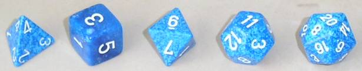

# Platonic dice

Life really is much like a box of chocolate, I suppose; Also, rock bottom really isn't too far away from the top of the world, certainly no further than a stone's throw. I mean, if nothing else, that much had become clear to me, after the horrendous emotional rollercoaster that was the time, when I first started high school; when I first fell in love。

Waking up the morning after our first date, everything still felt like the most wonderful dream ever to me, except that it was no mere fantasy; I really was dating the number one it girl at school. ( and a bona fide math genius. )

This was also when it first occurred to me, that doing well can actually earn you a good deal of resentment, rather than approval, from your peers.

Now, in hindsight, we probably should have been a bit more mindful of the slightly over the top ラブラブ(lovey-dovey) first time romantic-couple silliness, including the occasional PDA, which, looking back, really was totally uncalled for, especially since it couldn't have been clearer, that half the school had the hots for the 部長, including the ppl on the math-club she presided over; including the female members!

Anyway, we'll get to some of that mess later. For now let's dwell on things much more pleasant!

It was in June; Monday. Our first day back at school after the グラッパ-festival.

I remember sitting there at my little desk, all the way back in the classroom, absent-mindedly gazing out the window; daydreaming.

RRRRRRR ( Sound of a bell ringing )

Lunch break.

Totally lost in thought I, as always, took out the bento my mom had, as always, gotten up early to prepare for me.

Still half asleep I was about to open the box, when someone's voice, unlike our school-bell, managed to wake me up for good.

She: "お邪魔します。（ excuse me for disturbing / interrupting you; greeting used when entering someone's home / classroom ）"

My heart skipped a couple beats; at least.

Me: "びっくり(you startled me)。"

She: "ごめん(sry), you didn't notice me standing there by the door, waving, - she blushed a little - and your friends told me it was okay for me to enter."

She smiled.

My "friends" stared.

I guess being a second-year and all did give her some authority over us 後輩(junior), still walking into someone else's classroom like that,... kinda daring, right?

She: "Wanna join me for lunch?"

My "friends" glared.

Me: "喜んで（with pleasure）！"

She: "Great! Let's go."

She led the way and before I knew what had happened, we were having our first lunch as a couple; all by ourselves, on the school-building's rooftop.

But then, for no apparent reason, the overall mood had noticeably turned south.

She seamed a little anxious.

Then, with her hands trembling a teeny bit, she slowly removed the lid of her lunch-box: It was packed with a ton of strange looking おにぎり(rice balls).

She: "Um,... usually I like getting 焼きそばパン(stir-fried noodles in hot dog bun) or something at the store, but today I thought maybe it could be fun trying to prepare something myself."

Me: "You made those?"

She blushed.

Me: "おいしそう(it looks delicious)!"

She smiled.

Me: "Can I try one?"

She: "Sure!"

She passed me one of her odd looking rice-balls.

Me: "いただきます(thank u for the meal I am about to eat)。"

There was silence.

She: "どう(how does it taste)?"

To describe the taste of that おにぎり as atrocious would definitely qualify as sugar-coating it.

Me: "うまい！"

I was starting to tear up a bit.

She: "本当(is that true)?"

I couldn't help but to cough a little.

Me: "うん（yes）。"

I broke a sweat.

She: "嘘つき(liar)!"

She: "I've tasted them and CLEARLY they're inedible! :-)"

Me: "I disagree!"

I gobbled down the entire thing.

She: "嘘(no way)!ありえない（I can't believe this）！"

I got dizzy for a second, but quickly recovered full consciousness.

Me: "Handmade food from maaa girl; WHAT A TREAT!"

She: "馬鹿!"

Me: "はい。"

She leaned against my shoulder.

She: "You know, before we met, I kinda used to think of myself as a bit of a regular tetrahedron..."

Me: "Huh?"

She giggled.

She: "Well, u do know about the famous five platonic solids, right?"

Me: "Mmm... no, not really; no."

She reached into her bag and took out a little box labeled 'Fun with Dice'. 

She: "ほら（there you are）。"

I opened it up.

Inside there were five strange looking dice. Well one semi-regular six sided die and four p weird ones.

Me: "ええ、何これ（wow, what is this）？"

She: "Well, when u roll a fair die, like the one they use in Vegas, you want for each side to come up with the same probability, right?"

Me: "Go on."

She: "Now think about the six sided die. What geometric shape does it have?"

Me: "Cube, right?"

She: "Correct!"

Me: "やった(yay)! Does that mean I'm officially a member of math club now?"

She: "馬鹿!"

Me: "はい。"

She: "Anyway, the cube is a perfectly symmetrical solid figure, but so is the tetrahedron, octahedron, dodecahedron and icosahedron."

Me: "えええ(sound of wondrous surprise)。"

I took out the five dice and had a bit of a closer look. Instead of the regular pips they had all numbers written on their sides. For example the cube-shaped die had its faces marked with numbers one through six. Another one looked something like a diamond to me and it had its faces marked one through eight. Two more dice looked kinda roundish to me and they were numbered one through twelve and one through twenty respectively. Finally, there was the extra odd one; it was shaped like a pyramid and it bore not just one but three numbers on each of its four triangular sides, so that the numbers would mark the corner coming up, rather than the face coming down, i suppose.

Anyway, here's a pic from wikipedia to make things clearer:

Me: "なるほど（i see）。"

Me: "Tetra-something means four-something... so basically what you are saying is that... somehow you felt like you were similar in some way to this perfectly unlucky(in Japan many ppl consider four to be an unlucky number) triangular pyramid?"

She: "Hmm... i guess so..."

Me: "Why?"

She sighed.

She: "You see, all of those five dice are deeply connected to another such die. They make for the perfect pairs if you will."

Me: "So, you mean, it's like they're geometric soulmates or something?"

She: "Exactly!"

Me: "Hmm, but wouldn't you need a sixth die for that to work, coz that would give u three pairs then... so... where's the sixth die?"

She: "There is none!"

Me: "You sure?"

She: "Trust me."

Me: "I don't get it. If every die is certain to partner up with somebody, but five is all u got,... isn't that like a contradiction?"

She: "No, bec you see, the tetrahedron is soulmate to itself."

Me: "Kinda reminds me of what that Roman fellow once said..."

She: "And what's that?"

Me (quoting): "I am never in such good company as when I am alone."

She started to tear up a bit.

She: "Actually, sounds kinda accurate..."

She: "But now..."

Me: "Now I came along..."

She: "...you cam along..."

We smiled at each other.

She: "...and RUINED it for me!"

We laughed.

After that we shared my food and goofed around with her peculiar collection of dice.

Me: "Wow, those are kinda fun!"

She: "Tell me about it！"

She: "We also use them for some of the games we like doing at the math club."

Me: "Speaking of the math-club..."

She: "Yes?"

Me: "I want in!"

She smiled.

She: "No, you don't!"

Me: "Yes I do!"

She: "Look. I know you have been practicing a little math lately, but you are still this TOTAL NOOB!"

Me: "So?"

She: "So, you're nowhere near ready for the club!"

Me: "Come on!"

She: "Listen, math is much like music in that regard... it's gonna take you years and years of serious practice before you'll be any good at it."

I raised my eyebrow.

She: "I mean, it's like you've just learned your open-position E chord on guitar, but you're already applying for the school-band. That's just not gonna work!"

Me: "Okay. Got it."

She: "Good. :-)"

Me: "You're still gonna help me improve though, right?"

She: "...idk, sounds like wasting effort on a hopeless case... :-)"

Me: "おいおい、いじめる(that's bullying)!... Just give me some math problem I can sink my teeth in; something that'll help me make some progress; That's all I'm asking for..."

She: "Alright, alright! If you insist."

She: "You really don't have to this, you know..."

I tried my best at mimicking my little sister's world-class pout.

She giggled.

She: "Hmm... well... let's see... how about this then:"

She: "Rolling those five dice, what's the probability of getting a 20?"

I felt puzzled.

She: "So for example, getting four ones and a sixteen would count."

Me: "Ahh, I see, so getting all fours would work too, right?"

She: "Correct."

Me: "Okay, got it!"

She looked skeptical.

Me: "No, I mean, now I understand the question, I think."

We laughed.

RRRRRRR ( Sound of the school bell ringing )

We got up.

She: "This was fun!"

Me: "That it was!"

We walked back to my classroom; Now side by side.

I pointed at the door.

Me: "Well, this is me."

She: "バイバイ（bye-bye）。"

She: "Oh, and... don't forget your homework! :-)"

Me: "No worries. I'll figure it out soon. You'll see. :-)"

Would you have been able to cope with that kinda domestic labor?

Ganbatte.
